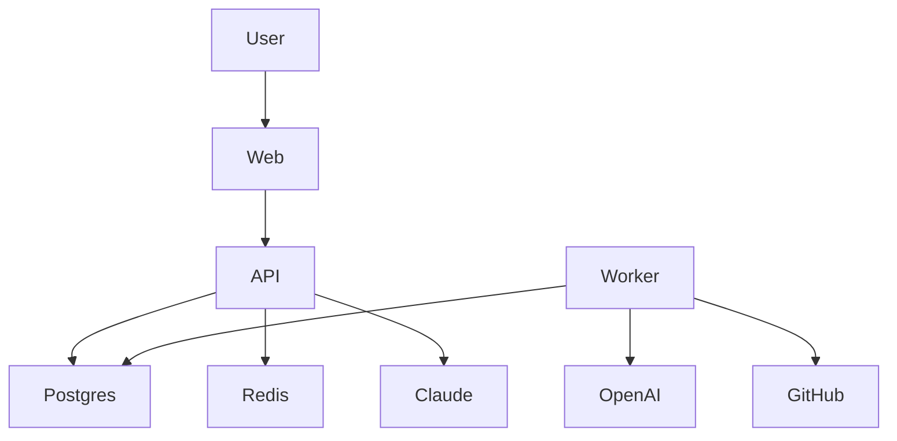
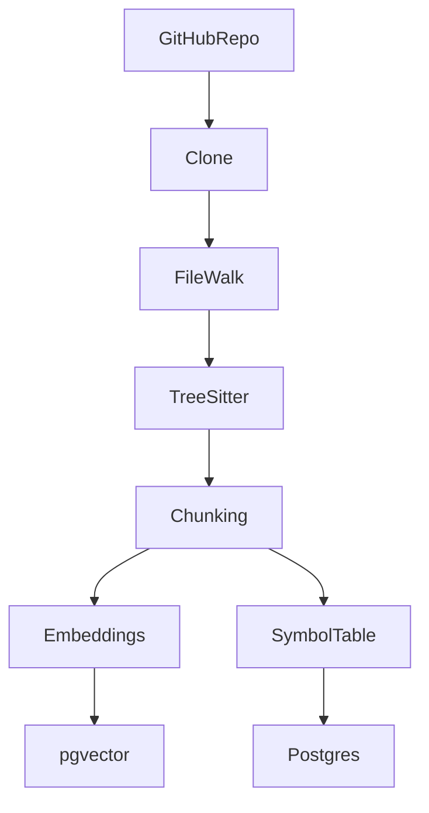
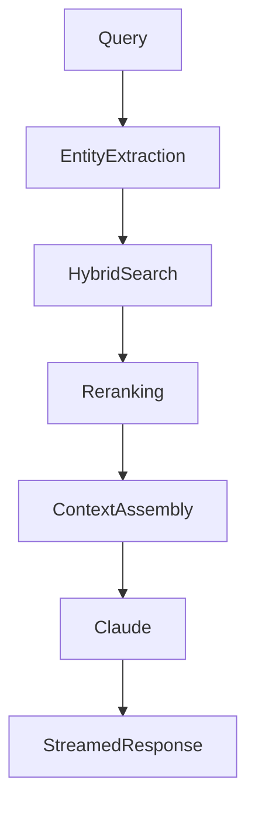

# Giro.gtdev — Engineering Intelligence Platform

## 1. Problem Statement

Modern codebases are difficult to understand.

Developers spend significant time reconstructing architecture mentally:

* tracing imports across dozens of files
* understanding hidden dependencies
* searching for business logic manually
* rebuilding context after every interruption
* onboarding into unfamiliar repositories

Most existing AI coding tools focus heavily on:

* autocomplete
* code generation
* inline suggestions

But they struggle with:

* repository-level reasoning
* architectural understanding
* cross-file retrieval
* durable engineering context
* structured repository intelligence

Giro.gtdev is designed to solve this problem.

The platform focuses on:

* repository understanding
* semantic indexing
* architecture-aware retrieval
* contextual engineering reasoning
* developer memory systems

Rather than acting as a fully autonomous coding agent, Giro is designed as an engineering intelligence layer that helps developers understand systems faster.

---

# 2. Product Vision

Giro.gtdev is an AI-powered engineering intelligence platform.

A developer connects a GitHub repository.
Giro indexes the repository, builds structural understanding, generates semantic embeddings, tracks relationships between files/symbols, and enables architecture-aware engineering queries.

The platform is optimized for:

* understanding large codebases
* onboarding faster
* debugging across files
* tracing architecture decisions
* semantic repository search
* contextual engineering conversations

V1 is intentionally read-only.

The first milestone is NOT autonomous coding.
The first milestone is building a reliable repository intelligence engine.

---

# 3. V1 Product Focus

The V1 goal of Giro.gtdev is to build a repository intelligence system that can:

* index repositories reliably
* understand code structure
* retrieve relevant engineering context
* answer architectural questions accurately
* maintain conversational engineering memory
* explain relationships between files and symbols

The platform intentionally prioritizes:

* retrieval quality
* repository understanding
* engineering clarity

over:

* autonomous code generation
* shell execution
* multi-agent orchestration
* enterprise workflows

---

# 4. Non-Goals (V1)

Giro.gtdev is NOT attempting to:

* replace IDEs
* autonomously modify repositories
* execute arbitrary shell commands
* become a generalized AGI coding agent
* support enterprise governance workflows
* optimize for massive organizations
* support multi-agent swarms
* provide production deployment automation

The focus is:

* repository intelligence
* engineering understanding
* architectural reasoning
* contextual retrieval

for individual developers and small teams.

---

# 5. Engineering Principles

## Retrieval Quality Over Infrastructure Complexity

Strong retrieval and context assembly matter more than distributed infrastructure.

## Minimize Operational Overhead

Prefer simple systems in V1.
Avoid unnecessary infrastructure.

## Postgres First

Prefer PostgreSQL extensions before introducing specialized databases.

## Read-Only By Default

The system should explain and retrieve before it modifies anything.

## Async Everything Expensive

Indexing, embeddings, summarization, and compression should run in background jobs.

## Fast Iteration Matters

Optimize for local development speed and developer velocity.

## Strong Observability From Day One

Every critical operation should be traceable and measurable.

## Build the Smallest Intelligent System First

Do not overbuild autonomous behavior early.

---

# 6. Tech Stack

## Frontend

* Next.js 15
* React
* TypeScript
* TailwindCSS
* shadcn/ui

## Backend

* Hono (high-performance TypeScript API framework)
* TypeScript
* SSE streaming

## Database

* PostgreSQL
* pgvector
* Prisma ORM

## Queueing / Background Jobs

* Redis
* BullMQ

## AI Layer

* Anthropic Claude (reasoning + Q&A)
* OpenAI text-embedding-3-small

## Parsing / Repository Intelligence

* tree-sitter
* Octokit

## Authentication

* GitHub OAuth
* JWT sessions

## Observability

* Sentry
* OpenTelemetry
* Structured JSON logs

## Deployment

* Docker Compose (local)
* Railway / Fly.io / Render
* Vercel (frontend)

---

# 7. System Architecture

## Deployable Components

### Web

Frontend application.
Responsible for:

* UI
* authentication
* dashboard
* repository workspace
* streaming chat interface

### API

Main backend service.
Responsible for:

* retrieval orchestration
* semantic search
* session management
* tool execution
* context assembly
* SSE streaming

### Worker

Background job processor.
Responsible for:

* repository indexing
* embeddings
* incremental sync
* summarization
* compression jobs

---

# 8. Architecture Diagrams

## High-Level Architecture

---

## Repository Indexing Flow

---

## Retrieval Pipeline

---

# 9. Core Features

## Repository Connection

* GitHub OAuth integration
* connect private/public repositories
* repository sync management
* webhook registration

## Repository Indexing

* shallow clone repository
* AST-aware chunking
* embedding generation
* symbol extraction
* import graph generation
* incremental re-indexing

## Repository Intelligence

* architecture overview
* dependency detection
* entry point detection
* module summaries
* symbol navigation
* semantic understanding

## Semantic Search

* vector search
* keyword search
* hybrid retrieval
* file/entity filtering
* ranked chunk retrieval

## Contextual Code Reasoning

* repository-scoped engineering Q&A
* architecture-aware answers
* contextual retrieval
* source citations
* session memory

## Session Memory

* persistent sessions
* engineering conversation history
* context compression
* pinned files
* session restoration

## Read-Only Tooling

* read_file
* grep_search
* list_directory
* find_symbol
* file_tree

---

# 10. V1 Scope

## Included

### Authentication

* GitHub OAuth
* JWT sessions
* account dashboard

### Repository Management

* connect repositories
* trigger indexing
* re-index repositories
* disconnect repositories
* repository status tracking

### Indexing Pipeline

* tree-sitter parsing
* semantic chunking
* embedding generation
* symbol extraction
* incremental indexing

### Search & Retrieval

* hybrid retrieval
* semantic search
* reranking
* token budget management

### Engineering Intelligence

* contextual Q&A
* architecture summaries
* source citations
* repository understanding

### Session Persistence

* session history
* conversational memory
* context compression

### Frontend Dashboard

* repository workspace
* search interface
* architecture overview
* session management

---

## Not Included (V2+)

* code modification
* shell execution
* autonomous agents
* multi-agent orchestration
* multi-region infrastructure
* IDE plugins
* distributed graph systems
* enterprise governance
* cross-repository retrieval
* self-hosted LLMs
* Kubernetes orchestration

---

# 11. Repository Intelligence

## Architecture Overview

Generated after indexing.

Includes:

* detected frameworks
* languages
* dependencies
* entry points
* folder structure
* module relationships
* key files
* heavily imported modules

---

## Symbol Extraction

Extract:

* functions
* classes
* methods
* exports
* imports
* modules

Used for:

* exact symbol retrieval
* navigation
* graph relationships
* contextual reasoning

---

## Import Graph

Track:

* imports
* symbol relationships
* module dependencies
* architectural centrality

Stored relationally in PostgreSQL.

---

# 12. Indexing Pipeline

## Repository Ingestion

1. GitHub webhook or user trigger
2. shallow clone repository
3. walk filesystem
4. apply include/exclude rules

---

## Parsing

Supported V1 languages:

* JavaScript
* TypeScript
* Python
* Go

Use tree-sitter for AST parsing.

---

## Chunking Rules

* one chunk per function/class/module
* markdown chunked by section
* config files chunked by top-level keys

Each chunk contains:

* file path
* entity type
* entity name
* line ranges
* token count
* embedding

---

## Embeddings

Model:

* text-embedding-3-small

Rules:

* batch embedding requests
* re-embed only changed chunks
* content-hash deduplication
* HNSW vector indexing

---

## Incremental Re-Indexing

On GitHub push:

* diff changed files
* re-parse changed files only
* re-embed changed chunks only
* preserve old index during rebuild

---

# 13. Retrieval System

## Retrieval Pipeline

Per engineering query:

1. extract entities from question
2. run hybrid retrieval
3. rerank candidates
4. apply diversity limits
5. enforce token budget
6. assemble context
7. stream response from Claude

---

## Hybrid Retrieval

### Vector Search

Top semantic matches using pgvector cosine similarity.

### Keyword Search

Use:

* pg_trgm
* PostgreSQL full-text search

### Symbol Retrieval

Exact symbol-name matching.

---

## Reranking Formula

Weighted scoring:

* vector relevance
* keyword relevance
* recency
* import centrality

---

## Context Assembly

Order:

1. pinned files
2. architecture overview
3. ranked chunks
4. conversation history

---

## Token Budgeting

| Section                 | Tokens |
| ----------------------- | ------ |
| System prompt           | 4k     |
| Architecture overview   | 2k     |
| Retrieved chunks        | 40k    |
| Conversation history    | 10k    |
| Reserved response space | 8k     |

---

## Conversation Compression

* recent turns stored verbatim
* older turns summarized asynchronously
* summaries generated using smaller models

---

# 14. Session & Memory System

## Sessions

Sessions are scoped to:

* user
* repository

Each session stores:

* messages
* tool calls
* citations
* summaries

---

## Pinned Files

Users can pin files into context.
Pinned files receive retrieval priority.

---

## Long-Term Memory

Future direction:

* engineering preferences
* architectural decisions
* repository evolution tracking

---

# 15. Read-Only Tooling

## Tools

### read_file

Read indexed file content.

### grep_search

Regex search across indexed files.

### list_directory

Return directory structure.

### find_symbol

Locate functions/classes.

### get_file_tree

Return repository structure.

---

## Tool Safety

* no shell execution
* no filesystem writes
* no arbitrary HTTP requests
* no git write operations

All tool calls are logged.

---

# 16. API Design

## Authentication

* GET /auth/github
* GET /auth/github/callback
* POST /auth/logout
* GET /auth/me

---

## Repository APIs

* GET /repos
* POST /repos/connect
* DELETE /repos/:id
* POST /repos/:id/reindex
* GET /repos/:id/summary

---

## Search APIs

* POST /repos/:id/search

---

## Session APIs

* POST /sessions
* GET /sessions
* GET /sessions/:id
* POST /sessions/:id/ask
* DELETE /sessions/:id

---

## Tool APIs

* POST /repos/:id/tools/read-file
* POST /repos/:id/tools/grep
* POST /repos/:id/tools/list-directory
* POST /repos/:id/tools/find-symbol

---

# 17. Core Database Models

## User

Stores:

* GitHub identity
* OAuth credentials
* account metadata

---

## Repository

Stores:

* repository metadata
* indexing status
* GitHub linkage

---

## CodeChunk

Stores:

* semantic chunks
* embeddings
* token counts
* line ranges

---

## Session

Stores:

* engineering conversations
* session metadata

---

## Message

Stores:

* user messages
* assistant responses
* citations
* tool interactions

---

## IndexJob

Stores:

* indexing lifecycle
* processing metrics
* failures

---

# 18. Supporting Database Models

## RepositorySummary

Generated architecture understanding.

## CodeSymbol

Extracted symbols and relationships.

## ToolCall

Audit log for tool execution.

## PinnedFile

Files pinned into context.

---

# 19. Observability

## Monitoring

* Sentry error tracking
* OpenTelemetry tracing
* request correlation IDs
* structured JSON logs

---

## Metrics

Track:

* retrieval latency
* embedding generation latency
* indexing duration
* token usage
* queue depth
* failed jobs
* cache hit rate
* API latency

---

## Alerts

Alert on:

* indexing failures
* queue backlogs
* failed embeddings
* retrieval timeouts
* API instability

---

# 20. Cost Controls

## Embedding Controls

* content-hash deduplication
* incremental re-indexing
* batch embedding requests

---

## Retrieval Controls

* strict token budgeting
* context compression
* retrieval caching

---

## Repository Limits

* maximum repository size
* maximum indexed file size
* chunk count limits

---

## Async Operations

Expensive operations run asynchronously:

* summarization
* indexing
* embeddings
* compression

---

# 21. Security

## Read-Only Boundary

* no file writes
* no shell execution
* no arbitrary code execution

---

## Secret Protection

Skip indexing:

* .env files
* private keys
* credentials

Redact detected secrets before persistence.

---

## OAuth Security

* encrypted token storage
* GitHub tokens never logged
* scoped permissions only

---

# 22. Retrieval Evaluation

## Metrics

### Precision@K

How relevant retrieved chunks are.

### Citation Accuracy

Whether citations support generated answers.

### Retrieval Latency

Time required to retrieve context.

### Context Assembly Latency

Time required to build final context window.

### Hallucination Rate

Frequency of unsupported answers.

### Embedding Freshness

Whether retrieval reflects latest indexed repository state.

---

# 23. Future Scope

## Future Retrieval Work

* graph-aware retrieval
* reranking optimization
* long-context orchestration
* cross-repository memory

---

## Future Agent Work

* controlled code modification
* approval workflows
* autonomous planning
* multi-agent orchestration

---

## Future Developer Experience

* VS Code extension
* IDE integrations
* repository timeline replay
* architecture visualizations

---

## Future Infrastructure

* multi-tenant architecture
* distributed indexing
* advanced observability
* enterprise deployment options

